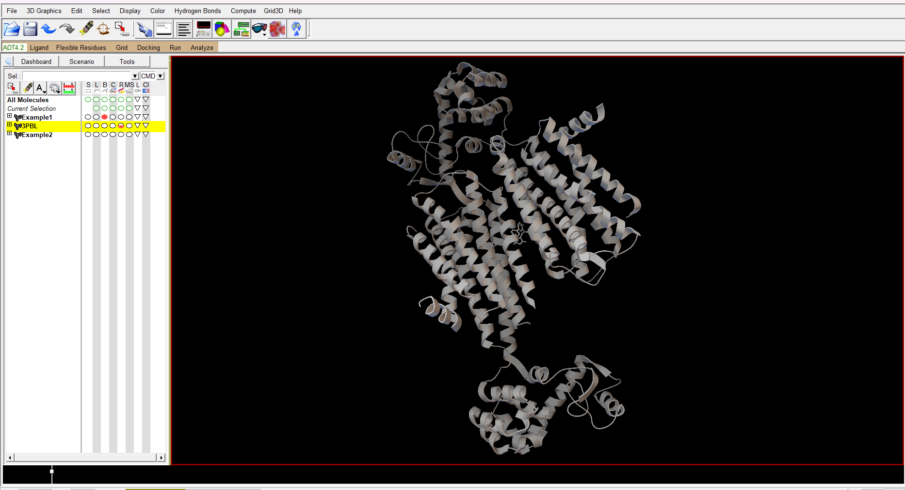

# GPCR_LigandClassify.py

========================================================

* Go to: https://zhanggroup.org/GLASS/, and download the interactions_active.tsv, ligands.tsv, and targets.tsv files.
* Save the files to a folder called: TSV_2; after having done so, they'll be ready to merge. 

** The following python libraries are required to run the model **

* Python 3.13
* Deepchem 1.x (requires RDKit)
* Scikitlearn (For MLPClassifier)
* Seaborn (For jointplot of XlogP and Molecular Weight)
* TSNE (For visualization of high-dimensional data)

# Autodock simulation after the DNN prediction

** Dopamine D3 Autodock structure example **

* Tutorial for Autodock Vina: https://vina.scripps.edu/tutorial/ 
* After you've watched the tutorial, input the SMILES from your ligand of choice into the MolFromSMILES_pdb.py file. After having done so, It'll then output a .pdb file; this file will act as the ligand in the Autodock simulation. 
* After you've dealt with the ligand, you're ready to setup the Protein docking structure. The way in which you go about doing this is by inputting the pdb_id into the ProteinDockingStructure_pdb.py file; after having done so, It should save a file named in accordance with the pdb_id. 
